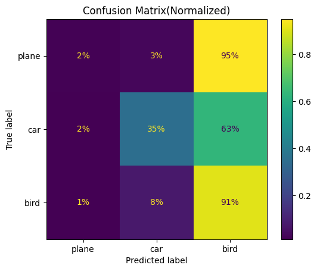

# Continual Learning on CIFAR-10: Demonstrating Catastrophic Forgetting

This repository demonstrates **Class-Incremental Continual Learning** using the **CIFAR-10** dataset in PyTorch, highlighting the well-known challenge of **Catastrophic Forgetting** during naive sequential model training.

---

## 📌 Table of Contents
- [Overview](#overview)
- [What is Catastrophic Forgetting?](#what-is-catastrophic-forgetting)
- [Experimental Procedure](#experimental-procedure)
  - [1. Data Splitting & Task Formulation](#1-data-splitting--task-formulation)
  - [2. Model Architecture](#2-model-architecture)
  - [3. Task 1 Training & Evaluation](#3-task-1-training--evaluation)
  - [4. Dynamic Head Expansion](#4-dynamic-head-expansion)
  - [5. Task 2 Training & Evaluation](#5-task-2-training--evaluation)
  - [6. Joint Evaluation on Previous and New Tasks](#6-joint-evaluation-on-previous-and-new-tasks)
- [Results & Confusion Matrix](#results--confusion-matrix)
  - [Observation & Analysis](#observation--analysis)
  - [Note on the 35% Car Accuracy](#note-on-the-35-car-accuracy)
- [Mitigation Strategies for Continual Learning](#mitigation-strategies-for-continual-learning)
- [How to Run](#how-to-run)

---

## 🧠 Overview

When artificial neural networks are trained on sequential tasks without access to previous data, new information overwrites previously acquired knowledge. This project empirically demonstrates this phenomenon by training a convolutional neural network (CNN) first on a 2-class classification problem (`plane` vs `car`), dynamically expanding the network's classification layer, and then fine-tuning it on a 3rd class (`bird`).

---

## 💥 What is Catastrophic Forgetting?

**Catastrophic Forgetting** (or catastrophic interference) is the tendency of a neural network to abruptly and drastically forget previously learned knowledge upon learning new information. 

In standard gradient descent optimization:
- Weights are adjusted to minimize loss exclusively on the current task's distribution.
- Shared feature representations and decision boundaries optimized for earlier classes are overwritten by gradients computed only on the newest task.
- The model develops severe recency bias, predicting the newly learned class for nearly all inputs.

---

## 🔬 Experimental Procedure

The experiment follows a structured class-incremental continual learning workflow as implemented in [`cifar_incremental_learning.ipynb`](./cifar_incremental_learning.ipynb):

```
+-----------------------------------------------------------------------------+
|                               CIFAR-10 Dataset                              |
+-----------------------------------------------------------------------------+
                                       |
                   +-------------------+-------------------+
                   |                                       |
         [ Task 1: Classes 0, 1 ]                [ Task 2: Class 2 ]
             (Plane, Car)                              (Bird)
                   |                                       |
                   v                                       v
         Train CNN (10 Epochs)                  Expand Output Head (2 -> 3)
         Optimizer: SGD                         Copy Weights & Biases
         Accuracy on Task 1: 96.70%             Train CNN on Task 2 (10 Epochs)
                                                Optimizer: Adam
                                                Accuracy on Task 2: 90.00%
                                                           |
                                                           v
                                            [ Joint Evaluation (Tasks 1 + 2) ]
                                            Normalized Confusion Matrix
```

### 1. Data Splitting & Task Formulation
- The standard CIFAR-10 dataset is split into sequential task subsets using PyTorch `Subset`:
  - **Task 1**: Classes `0` (`plane`) and `1` (`car`)
  - **Task 2**: Class `2` (`bird`)
  - (Remaining tasks defined for future extension: classes `3` to `9`)

### 2. Model Architecture
A custom CNN (`ImageNet` class) is constructed with:
- **Convolutional Feature Extractor**: 4 sequential Conv blocks with $3\times3$ kernels, `BatchNorm2d`, `ReLU` activations, and `MaxPool2d` (channel progression: $3 \rightarrow 32 \rightarrow 64 \rightarrow 128 \rightarrow 256$).
- **Multi-Layer Classification Head**: Fully connected layers with `BatchNorm1d`, `ReLU`, and `Dropout(0.5)` ($256 \rightarrow 128 \rightarrow 64 \rightarrow 10 \rightarrow 2$).

### 3. Task 1 Training & Evaluation
- The model is initialized with an output dimension of 2.
- Trained for **10 epochs** using `SGD(lr=0.001, momentum=0.9)` and `CrossEntropyLoss`.
- **Task 1 Performance**: Achieved **96.70% test accuracy** on `plane` vs `car`.

### 4. Dynamic Head Expansion
- The final classification layer is replaced from `nn.Linear(10, 2)` to `nn.Linear(10, 3)` to accommodate class 2 (`bird`).
- The previously learned weights and biases for the first two classes are preserved into the new layer (`new_fc.weight[:2] = old_fc.weight[:]`, `new_fc.bias[:2] = old_fc.bias[:]`).

### 5. Task 2 Training & Evaluation
- The expanded network is trained on **Task 2 only** (class `bird`) for **10 epochs** using `Adam(lr=0.001)`.
- **Task 2 Performance**: Achieved **90.00% test accuracy** on `bird`.

### 6. Joint Evaluation on Previous and New Tasks
- A combined dataset containing all three classes (`task1_loader.dataset + task2_loader.dataset`) is evaluated.
- Predictions across `plane`, `car`, and `bird` are collected and visualized using `sklearn.metrics.ConfusionMatrixDisplay`.

---

## 📊 Results & Confusion Matrix

Below is the normalized confusion matrix obtained after training sequentially on Task 1 followed by Task 2:



### Performance Breakdown

| True Class | Predicted as Plane | Predicted as Car | Predicted as Bird |
|:----------:|:-------------------:|:----------------:|:-----------------:|
| **Plane**  | **2%**              | 3%               | **95%**           |
| **Car**    | 2%                  | **35%**          | **63%**           |
| **Bird**   | 1%                  | 8%               | **91%**           |

### Observation & Analysis
- **Severe Degradation on Task 1**: Despite the model having achieved **96.70%** accuracy on `plane` and `car` earlier, it now misclassifies **95%** of plane images and **63%** of car images as **bird**.
- **Dominance of Recent Task**: The network exhibits strong recency bias, directing the majority of activations towards the newly learned class (`bird`).

### ⚠️ Note on the 35% Car Accuracy
> While the confusion matrix shows a **35%** accuracy for the `car` class, this is largely attributed to **random variation / stochastic luck** in weight space during optimization. In previous experimental runs, the accuracy for `car` dropped down to around **2%** (matching the near-total loss seen in `plane` at 2%). This variation highlights that without dedicated continual learning mechanisms, retention of past classes is unstable and fails catastrophically.

---

## 🛡️ Mitigation Strategies for Continual Learning

To overcome catastrophic forgetting, future extensions can implement established continual learning strategies:

1. **Replay Methods**:
   - *Experience Replay*: Maintain a small memory buffer (exemplars) of past task samples and interleave them during training.
   - *Generative Replay*: Train a generative model (GAN/VAE/Diffusion) to synthesize past data distributions.
2. **Regularization-Based Methods**:
   - *Elastic Weight Consolidation (EWC)*: Penalize updates to parameters critical to prior tasks using the Fisher Information Matrix.
   - *Synaptic Intelligence (SI)* / *Memory Aware Synapses (MAS)*: Compute per-parameter importance online.
3. **Knowledge Distillation**:
   - *Learning without Forgetting (LwF)*: Use the previous model's output logits as soft targets to constrain representation shifts.
4. **Architectural & Parameter Isolation Methods**:
   - *Progressive Neural Networks*, *PackNet*, or *Parameter-Efficient Tuning (LoRA/Adapters)*: Allocate task-specific parameter sub-networks or modules.

---

## 🚀 How to Run

1. Clone the repository and navigate to the project directory:
   ```bash
   git clone https://github.com/<your-username>/cifar-incremental_learning.git
   cd cifar-incremental_learning
   ```

2. Install dependencies:
   ```bash
   pip install torch torchvision matplotlib scikit-learn
   ```

3. Open and run [`cifar_incremental_learning.ipynb`](./cifar_incremental_learning.ipynb) in Jupyter Notebook, VS Code, or Google Colab.
